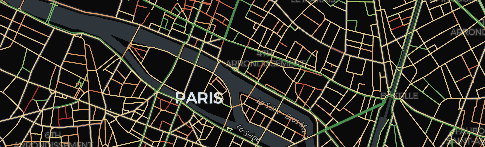

# Cyclability Mapper
Cyclability Mapper is a Python-based system for computing segment-level and city-level cyclability metrics from OpenStreetMap (OSM) road data. The system ingests raw OSM data, normalizes and segments the road network, computes a simplified cyclability metric, and stores results in a spatial relational database (PostGIS) for analysis, API access, and map-based access using Kepler.gl.

The project is structured as a complete pipeline: from geospatial data ingestion to quality metrics computation and visualization. While the current focus is on cyclability, the architecture may be applied to other quality indices.

## System Structure

The system is organized as follows:
- **Input**: OpenStreetMap road network data retrieval from Overpass API.
- **Processing**: Normalization of OSM tags, segmentation and derivation of city network, computation of metrics per segment, and aggregation into city-level metrics. Missing data is tracked as qualitative uncertainty.
- **Storage**: PostgreSQL with PostGIS is used as authoritative storage system for geometries, features, and computed metrics.
- **Orchestration**: Application services and databases are coordinated using Docker Compose.
- **Output**:
  - Cyclability metrics per segment
  - City-level aggregated metrics with uncertainty indicators
  - FastAPI-based data access and Kepler.gl-based maps for results exploration

## Resources

- [**Documentation**](docs/): Detailed description of data model, process pipeline, metrics definition, database schema, jobs, and API structure.

## Quick Start

To run the project, it is recommended to use Docker. The instructions below assume a macOS environment using Colima VM, but the same Docker Compose setup may be adjusted for use with other systems.

Install the required tools:
```bash
brew install colima
brew install docker
brew install docker-compose
```

Start Colima VM with enough resources for PostGIS and data processing, for example:
```bash
colima start --cpu 4 --memory 8
```

Start all services:
```bash
docker compose up --build
```

Data ingestion and network building can then be executed by using the CLI jobs provided.

For example, to build the road network and compute cyclability metrics for Oslo, Norway:
```bash
docker compose exec app python -m city_metrics.jobs.build_network --c oslo --cc no --chunk 5000 --tout 50 --tol 0.0005
```
where:
- `--c` is the city name
- `--cc` is the country code (ISO-2)
- `--chunk` (optional) is the maximum number of segments per chunk to be processed in one go
- `--tout` (optional) is the timeout time used during API fetch
- `--tol` (optional) is the tolerance used to simplify city outline Polygon before fetch

The job will:
- Define the administrative city boundary
- Fetch OSM road data available within the boundary
- Normalize and segment the network
- Compute cyclability metrics
- Store results in PostGIS

Multiple cities can be stored in the database. Missing YAML mapping data are prompted during execution to the user in CLI environment and used to update the YAML table.

After the pipeline is run, results can be explored in three ways:
- **Map**: A map rendering metrics for the city:
  ```bash
  http://localhost:8000/maps/oslo
  ```
- **API**: Data per segment retrieved via OSM ID:
  ```bash
  http://localhost:8000/api/segments/oslo/4708813
  ```
- **Figures**: A few key figures are also returned: 
  ```bash
  http://localhost:8000/figures/{figure_name}
  ```

Endpoint details and CLI jobs are described in the project documentation.

## Project Structure
- `docker/`: Database schema initialization (init.sql).
- `docs/`: Technical documentation.
- `frontend/`: Frontend-related code (for now, it includes Kepler.gl visualization).
- `src/city_metrics/`: Source code: ingestion, normalization, metrics computation, database services, API, and CLI jobs.

## Status
The project is currently under development.