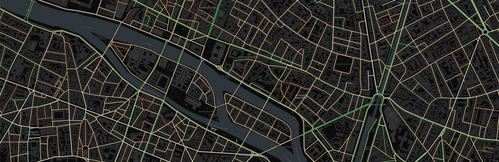

[](LICENSE)


# Cyclability Mapper
Cyclability Mapper is a Python-based system for computing segment-level and city-level cyclability metrics from OpenStreetMap (OSM) road data. The system ingests raw OSM data, normalizes and segments the road network, computes a simplified cyclability metric, and stores results in a spatial relational database (PostGIS) for analysis, API access, and map-based access using Kepler.gl.

The project is structured as a complete pipeline: from geospatial data ingestion to quality metrics computation, visualization, and analysis. While the current focus is on cyclability, the architecture may be applied to other quality indices.

Static map-based access of selected European capitals are available through GitHub Pages: [Amsterdam](https://omarelbeshbichi.github.io/cyclability-mapper/maps/amsterdam.html), [Helsinki](https://omarelbeshbichi.github.io/cyclability-mapper/maps/helsinki.html), [London](https://omarelbeshbichi.github.io/cyclability-mapper/maps/london.html), [Oslo](https://omarelbeshbichi.github.io/cyclability-mapper/maps/oslo.html).


## Demo AWS Deployment

A system demo has been also deployed in AWS using free-tier resources. As an example, the following links redirect, respectively, to a scatter table of all city scores (and score uncertainties) in the deployed database, a map-based access of results of Utrecht, NL, and an API retrieval for a segment of the same city:

> https://cyclability-mapper.duckdns.org/figures/metrics_scatter

> https://cyclability-mapper.duckdns.org/maps/utrecht

> https://cyclability-mapper.duckdns.org/api/segments/utrecht/27370348 

 See [**related documentation**](docs/demo_aws_deployment.md) for more info.


## System Structure

The system is organized as follows:
- **Input**: OpenStreetMap road network data retrieval from Overpass API.
- **Processing**: Normalization of OSM tags, segmentation and derivation of city network, computation of metrics per segment, and aggregation into city-level metrics. Missing data is tracked as qualitative uncertainty.
- **Storage**: PostgreSQL with PostGIS is used as authoritative storage system for geometries, features, and computed metrics.
- **Orchestration**: Application services and databases are coordinated using Docker Compose.
- **Analysis**: Two experimental analyses are also included, ie, sensitivity analysis to quantify robustness of metrics with respect to group weights, and graph analysis to identify which segments would provide the largest cyclability improvement given a budget in km. These analyses are experimental and have been included mainly to explore the underlying modules (networkx, especially).
- **Output**:
  - Cyclability metrics per segment
  - City-level aggregated metrics with uncertainty indicators
  - FastAPI-based data access and Kepler.gl-based maps and figures for results exploration

## Resources

- [**Documentation**](docs/): Detailed description of data model, process pipeline, metrics definition, database schema, jobs, analyisis, and API structure.


## Quick Start

To run the project, it is recommended to use Docker. The instructions below assume a macOS environment using Colima VM, but the same Docker Compose setup may be adjusted for use with other systems.

Install the required tools:
```bash
brew install colima
brew install docker
brew install docker-compose
```

Start Colima VM with enough resources for PostGIS and data processing, for example:
```bash
colima start --cpu 4 --memory 8
```

Start all services:
```bash
docker compose up --build
```

Data ingestion and network building can then be executed by using the CLI jobs provided.

For example, to build the road network and compute cyclability metrics for Oslo, Norway:
```bash
docker compose exec app python -m city_metrics.jobs.build_network --city oslo --cc no --chunk 5000 --tout 50 --tol 0.0005 --no-tiling --retries 50 --delay 5.0
```
where:
- `--city` is the city name
- `--cc` is the country code (ISO-2)
- `--chunk` (optional) is the maximum number of segments per chunk to be processed in one go
- `--tout` (optional) is the timeout time used during API fetch
- `--tol` (optional) is the tolerance used to simplify city outline Polygon before fetch
- `--no-tiling (--tiling)` (optional) is a bool flag used to enable decomposition of fetch Polygon into small boxes (more fetches are less demanding on RAM capacity).
- `--retries` (optional) is the number of Overpass API connection retries allowed.
- `--delay` (optional) is the delay in seconds between Overpass API connections.

The job will:
- Define the administrative city boundary
- Fetch OSM road data available within the boundary
- Normalize and segment the network
- Compute cyclability metrics
- Store results in PostGIS

Multiple cities can be stored in the database. Large cities may need increased memory limits in Colima and smaller chunk sizes.

Note: OSM data quality and availability vary by city. Missing or ambiguous tags will trigger interactive prompts during the ingestion stage. These mappings are stored and reused.

After the pipeline is run, results can be explored in three ways:
- **Map**: A map rendering metrics for the city:
  ```bash
  http://localhost:8000/maps/oslo
  ```
- **API**: Data per segment retrieved via OSM ID:
  ```bash
  http://localhost:8000/api/segments/oslo/4708813
  ```
- **Figures**: Figures of key results: 
  ```bash
  http://localhost:8000/figures/{figure_name}
  ```

Endpoint details and CLI jobs are described in the project documentation.

## Local development (optional)

For development of pure Python logic and tests:
```bash
python -m venv .venv
source .venv/bin/activate
pip install -e '.[dev]'
pytest
```

## Project Structure
- `docker/`: Database schema initialization (init.sql).
- `docs/`: Technical documentation.
- `frontend/`: Frontend-related code (for now, it includes Kepler.gl visualization).
- `src/city_metrics/`: Source code: ingestion, normalization, metrics computation, database services, API, analysis, and CLI jobs.

## Status

The project is currently under development.

## Contributing

Contributions, bug reports, and suggestions are welcome.

If you plan to contribute code, please open an issue first to discuss scope and design. Small fixes and improvements can be submitted directly via pull request.

## License

This project is licensed under the MIT License. See the [LICENSE](LICENSE) file for details. 